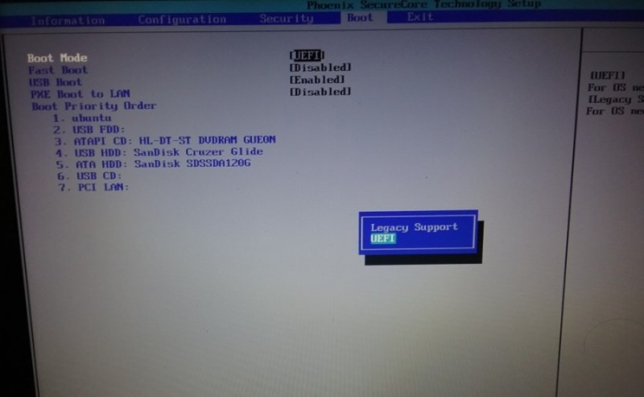
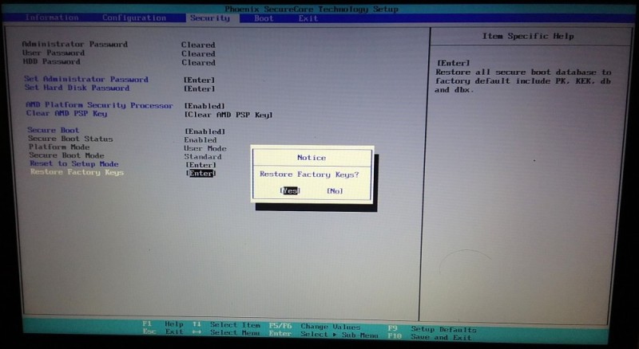

# UEFI Tutorial

This is a tutorial to help developers ramp up on UEFI environment and programming. (The acronyms UEFI and EFI are used interchangeably) The intended audience is a C programmer with basic knowledge of computer architecture and system programming (paging, adressing modes ... etc).

1. In the remainder of this page, an overview of UEFI is presented with notes on setting up Ubuntu on an EFI platform.

2. In [Section 2](pages/section2/section2.md), two UEFI development environments are described with notes on how to set up the two environments and use them.

3. In [Section 3](pages/section3/section3.md), the UEFI execution environment is described in more detail along with notes on accessing UEFI services. Example code is presented.

4. In [Section 4](pages/section4/section4.md), UEFI Secure Boot is described in detail along with key databases, code signing, and related utilities.

----------------------------------------------

## Useful Resources

Some useful resources are listed below. This tutorial copies a lot of material from the UEFI specification.

1. [UEFI Specification](http://www.uefi.org/specifications) (this tutorial uses Version 2.3.1)

2. [http://www.rodsbooks.com/](http://www.rodsbooks.com/efi-programming/index.html) (a little out of date)

3. [EFI Toolkit repo](https://github.com/tianocore/tianocore.github.io/wiki/EFI-Toolkit)

4. [EDKII documentation](https://github.com/tianocore/tianocore.github.io/wiki/EDKII-EADK)

5. [EDKII main repo](https://github.com/tianocore/edk2)

## What is UEFI?

The Unified Extensible Firmware Interface (UEFI) Specification describes an interface between the operating system (OS) and the platform firmware. UEFI is a replacement of the legacy BIOS interface.

> The interface is in the form of data tables that contain platform-related information, and boot and runtime service calls that are available to the OS loader and the OS. Together, these provide a standard environment for booting an OS.

Services provided by UEFI may be as simple as memory allocation and management or providing memory lay-out information, or launching another piece of UEFI code from a file. Also, UEFI supports more sophisticated services such as reading from or writing to FAT file systems, providing access to mouse, keyboard, and frame buffers, and even networking operations and security services. While the specification lists a large number of services, the actual firmware implementation may only provide a subset of those services.

## UEFI Images

UEFI executable images are packed as PE/COFF images (Windows binary format). Images may be loaded from a file system or over the network. Images may be executed directly by the firmware or by other UEFI executables through the firmware.

UEFI images may be boot-service drivers or run-time-service drivers that implement boot-time or run-time services. However, the scope of this tutorial is limited to UEFI applications.

UEFI applications may be like utilities that perform a specific task and return control to the caller or launch another UEFI application (just like command-line utilities in Linux). OS-loaders are a special type of application that take control of the system (away from UEFI boot-time services) and pass control to an operating system.

The concept of run-time services, boot-time services, and exit-boot-services are described in greater detail later in this tutorial. The following figure provides a summary of the different types of images.

## Booting a UEFI Platform

UEFI platforms are expected to have a single EFI System Partition (ESP). The ESP is a specially marked FAT-formatted partition in a storage device (disk, USB flash drive, etc ...). The device may be partitioned using MBR format or GPT format. The firmware loads UEFI images from this partition.

UEFI platforms boot under the control of the UEFI Boot Manager in the firmware. The UEFI Boot Manager loads or attempts to load a sequence of drivers and applications based on some policy specified through UEFI variables. UEFI variables and boot policy are described in greater detail later in this tutorial.

If a valid image is not found through the boot policy, or in case of booting from removable media, the boot manager will attempt to load an image from a default path. The default path is architecture specific (x86, x86-64, Itanium, ARM). For x86-64 platforms, the default path is `\EFI\BOOT\BOOTx64.efi`. Since the ESP is FAT-formatted, file paths are not case sensitive.

## Ubuntu on EFI Platforms

UEFI can be configured to emulate the legacy BIOS interface through a component called Compatibility Support Module (CSM). However, CSM must be disabled to enable UEFI Secure Boot.

Vanilla Ubuntu images will work on both UEFI and legacy BIOS platforms. To ensure Ubuntu installs with UEFI support, the firmware should be configured (through startup menu) as listed below:

* CSM (also called legacy boot mode) should be disabled
* UEFI Secure Boot should be enabled
* UEFI Secure Boot should be in "User Mode" with factory/default keys installed.

Note: The system must be reset for these changes to take effect.

Once the firmware is configured as described above, Ubuntu can be installed as usual. Ubuntu uses an EFI image called the shim on platforms that use Microsoft certificates for secure boot. The shim is signed with a Microsoft key. The shim is responsible for launching the GRUB EFI image.

Some relevant parts of the firmware menu from an AMD laptop are shown in the images below:

**Figure: Setting the frimware to strict UEFI mode (no legacy support)**

**Figure: Setting factory-default UEFI keys**

### EFI System Partition

On Ubuntu, the EFI system partition (ESP) is mounted at `/boot/efi`. The partition is mounted with read, write, and execute access restricted to root.

        $ sudo ls -R /boot/efi
        /boot/efi:
        EFI

        /boot/efi/EFI:
        ubuntu

        /boot/efi/EFI/ubuntu:
        fw  fwupx64.efi  grub.cfg  grubx64.efi	mmx64.efi  shimx64.efi

        /boot/efi/EFI/ubuntu/fw:

As seen above, Ubuntu uses a non-default locations for the shim and GRUB images:

* `/boot/efi/EFI/ubuntu/shimx64.efi`
* `/boot/efi/EFI/ubuntu/grubx64.efi`

As a result, Ubuntu requires boot variables to be configured to point the firmware to the correct EFI image at startup. Boot variables are described in greater detail below.

### `sysfs`

UEFI services can be divided into run-time services and boot-time services. Boot-time services are only available at boot time. Run-time services are always available.

UEFI variables are accessed through run-time services. This includes the boot variables mentioned earlier as well as the key variables used by secure boot. Linux provides access to these variables to user space through `sysfs`. Specifically, the `efivars` kernel module provides virtual files at the following path to access the UEFI variables:

        $ ls /sys/firmware/efi/efivars/
        AcpiGlobalVariable-af9ffd67-ec10-488a-9dfc-6cbf5ee22c2e     NotFirstBoot-70040abc-6387-4588-87b1-ddcd6c7d7af5
        AMITCGPPIVAR-a8a2093b-fefa-43c1-8e62-ce526847265e           ONBOARD_DEVS_PRESENT-d98397ee-7a9d-457a-a9df-e568ae87cc18
        AMITSESetup-c811fa38-42c8-4579-a9bb-60e94eddfb34            OsIndications-8be4df61-93ca-11d2-aa0d-00e098032b8c
        ...

Note: Security-sensitive variables (the UEFI key variables, for example) are authenticated. Write operations (replace or append) of those variables must be signed. Signature validation (even at run-time) is performed by the firmware itself.

UEFI variables are described in greater detail in a later section.

### `efibootmgr`

Boot variables are used to conifgure the firmware regarding where to find EFI images (paths in the system partition) and the sequence in which to boot them. While `efivars` exposes the raw boot variables, the `efibootmgr` utility provides a more user-friendly way to access the variables using the same virtual files in `sysfs`.

`efibootmgr` should be installed by default in Ubuntu on UEFI platforms. Otherwise, it can be installed with `apt`.

        $ sudo apt install efibootmgr

Without any additional options, `efibootmgr` prints a list of the boot-related variables:

        $ sudo efibootmgr -v
        BootCurrent: 0000
        Timeout: 0 seconds
        BootOrder: 0000,0001,0002,0008,0006,0007
        Boot0000* ubuntu	HD(4,GPT,0882ec5f-da2e-48ef-8ba3-d1a11cdadfa2,0x800,0x1eb800)/File(\EFI\ubuntu\shimx64.efi)
        Boot0001* DTO UEFI USB Floppy/CD	VenMedia(b6fef66f-1495-4584-a836-3492d1984a8d,0500000001)AMBO
        Boot0002* DTO UEFI USB Hard Drive	VenMedia(b6fef66f-1495-4584-a836-3492d1984a8d,0200000001)AMBO
        Boot0006* DTO Legacy USB Floppy/CD	VenMedia(b6fef66f-1495-4584-a836-3492d1984a8d,0500000000)AMBO
        Boot0007* Hard Drive	VenMedia(b6fef66f-1495-4584-a836-3492d1984a8d,0200000000)AMBO
        Boot0008* KingstonDataTraveler 3.0PMAP	PciRoot(0x0)/Pci(0x1a,0x0)/USB(1,0)/USB(3,0)/HD(1,MBR,0x4294967194,0x3f,0x39d2bc1)AMBO

The file paths are specified as "device paths", a special format used by UEFI to specify paths (since there is no concept of mount point or root file system from the firmware perspective).

If the boot variable labeled `ubuntu` (`Boot0000`) was absent, it could be created with the command:

        efibootmgr -b 0000 -w -c -d /dev/sda -p 4 -l "\EFI\ubuntu\shimx64.efi" -L "ubuntu".

Refer to the man page for `efibootmgr` for more details. Also, the EFI boot process is described in greater detail on [this page](pages/bootmgr/bootmgr.md).

### `efi-tools` and `sbsigntool`

If secure boot is enabled, the UEFI firmware will only launch EFI images that are authorized. An image is authorized if

* the image is signed with a key whose certificate is present in the key database
* or a hash of the image is present in the key database

The key databases are UEFI variables. When secure boot is enabled, these variables are authenticated: write-operations to these variables must be signed.

The `sbsigntool` package provides utilities to sign EFI images, attach signatures to images, and verify images against certificates. The `efi-tools` package provides utilities to hash EFI images, and utilities to created signed updates to authenticated EFI variables. Details of how to use these utilities are presented in Section 4. The steps to build and install these packages are presented on these pages.

Ubuntu provides `sbsigntool` and `efi-tools` packages through `apt`. However, the versions of these packages that come with Ubuntu are older broken versions. Working versions of these packages can be installed from source. Following is a list of commands to install these packages from source.

        $ mkdir efi-secureboot-tools
        $ cd efi-secureboot-tools/

        $ sudo apt install git gnu-efi libssl-dev libssl-doc zlib1g-dev libfile-slurp-perl help2man
        $ git clone http://github.com/mjg59/efitools
        $ cd efitools/
        $ make
        $ sudo make install
        $ cd ../

        $ sudo apt install autoconf automake autotools-dev m4 libltdl-dev libtool binutils-dev uuid-dev
        $ git clone https://git.kernel.org/pub/scm/linux/kernel/git/jejb/sbsigntools.git
        $ cd sbsigntools

Modify the URL inside "`.gitmodules`" file from "`git://git.ozlabs.org/~ccan/ccan`" to "`https://github.com/rustyrussell/ccan.git`".

        $ ./autogen.sh
        $ ./configure
        $ make
        $ sudo make install
        $ cd ../

In addition to signing EFI images and producing key updates, `efi-tools` contains utilities to access the UEFI key variables through the virtual files in `sysfs`. Note: When Secure Boot is enabled and the platform is in _User_ mode, any write operations to the key variables must be appropriately signed.

The following example shows the key variables printed using the `efi-readvar` utility on an AMD laptop. As seen below, the platform key, `PK`, is a Lenovo key, and the key-exchange keys, `KEK`, are Microsoft keys. These keys are explained in greater detail in Section 4.

        $sudo efi-readvar
        Variable PK, length 852
        PK: List 0, type X509
            Signature 0, size 824, owner e04fd794-033e-46a0-81d2-048e8da1432e
                Subject:
                    CN=Ideapad Products
                Issuer:
                    CN=Trust - Lenovo Certificate
        Variable KEK, length 1560
        KEK: List 0, type X509
            Signature 0, size 1532, owner 77fa9abd-0359-4d32-bd60-28f4e78f784b
                Subject:
                    C=US, ST=Washington, L=Redmond, O=Microsoft Corporation, CN=Microsoft Corporation KEK CA 2011
                Issuer:
                    C=US, ST=Washington, L=Redmond, O=Microsoft Corporation, CN=Microsoft Corporation Third Party Marketplace Root
        Variable db, length 4068
        db: List 0, type SHA256
            Signature 0, size 48, owner e04fd794-033e-46a0-81d2-048e8da1432e
                Hash:14e62a4905e19189e70828983165939afc0a331d0b415f3332b0e818a827f436
        db: List 1, type X509
            Signature 0, size 821, owner e04fd794-033e-46a0-81d2-048e8da1432e
                Subject:
                    CN=1L510-1415ABR
                Issuer:
                    CN=Trust - Lenovo Certificate
        db: List 2, type X509
            Signature 0, size 1572, owner 77fa9abd-0359-4d32-bd60-28f4e78f784b
                Subject:
                    C=US, ST=Washington, L=Redmond, O=Microsoft Corporation, CN=Microsoft Corporation UEFI CA 2011
                Issuer:
                    C=US, ST=Washington, L=Redmond, O=Microsoft Corporation, CN=Microsoft Corporation Third Party Marketplace Root
        db: List 3, type X509
            Signature 0, size 1515, owner 77fa9abd-0359-4d32-bd60-28f4e78f784b
                Subject:
                    C=US, ST=Washington, L=Redmond, O=Microsoft Corporation, CN=Microsoft Windows Production PCA 2011
                Issuer:
                    C=US, ST=Washington, L=Redmond, O=Microsoft Corporation, CN=Microsoft Root Certificate Authority 2010
        Variable dbx, length 3752
        dbx: List 0, type SHA256
            Signature 0, size 48, owner 77fa9abd-0359-4d32-bd60-28f4e78f784b
                Hash:80b4d96931bf0d02fd91a61e19d14f1da452e66db2408ca8604d411f92659f0a
            Signature 1, size 48, owner 77fa9abd-0359-4d32-bd60-28f4e78f784b
                Hash:f52f83a3fa9cfbd6920f722824dbe4034534d25b8507246b3b957dac6e1bce7a
            Signature 2, size 48, owner 77fa9abd-0359-4d32-bd60-28f4e78f784b
        ...

----------------------------------------------
__[Next: EFI Development](pages/section2/section2.md)__
